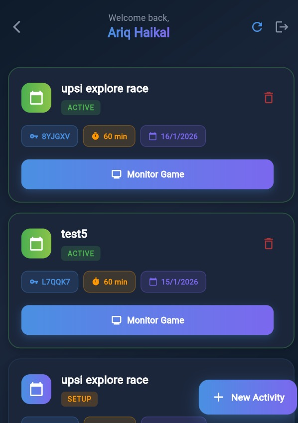
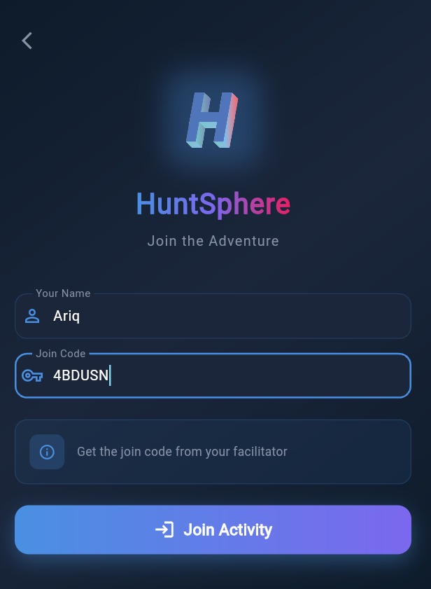
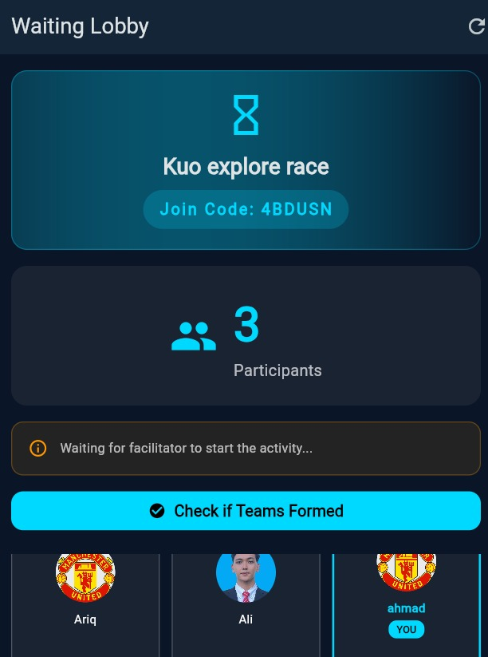
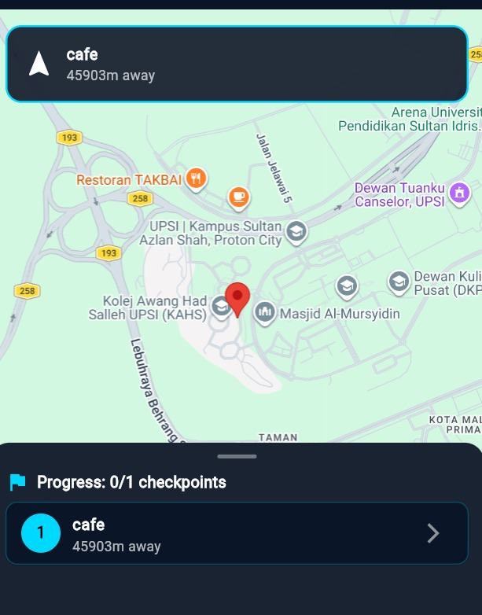

<div align="center">

# HuntSphere

**GPS-Based Treasure Hunt Platform**

<p>
  
  
  
  
  
  
</p>

A **GPS-powered digital explorace platform** that enables facilitators to create, manage, and monitor treasure hunt activities in real-time — with automatic team formation, geofencing checkpoints, live leaderboards, an AI chatbot assistant, and exportable post-game reports.

[Getting Started](#-getting-started) · [Features](#-key-features) · [Architecture](#-architecture) · [Database Schema](#-database-schema) · [Service Layer](#-service-layer) · [Game Flow](#-game-flow)

</div>

---

## Screenshots

<div align="center">

### Facilitator Side

| Dashboard |
|:---------:|
|  |

### Participant Side

| Join Activity | Waiting Lobby |
|:-------------:|:-------------:|
|  |  |

| Game Map with GPS Tracking |
|:--------------------------:|
|  |

</div>

---

## Overview

HuntSphere is a **cross-platform mobile application** (Flutter) designed for organizing and running GPS-based treasure hunt ("explorace") activities. It serves two distinct user types:

- **Facilitator** — creates and manages the activity, sets up GPS checkpoints and tasks, manages the lobby, monitors progress live, reviews photo submissions, and exports reports.
- **Participant** — joins via a 6-character code, gets auto-assigned to a team, navigates to checkpoints via GPS, completes tasks (quiz, photo, QR scan), and competes on a live leaderboard.

The system uses **Supabase** as the backend (PostgreSQL + Auth + Realtime + Storage), **Google Maps** for GPS tracking and geofencing, **Riverpod** for state management, **Hive** for offline caching, **Groq/OpenAI** for the AI chatbot assistant, and **PDF/CSV** generation for post-game reports.

---

## Tech Stack

| Layer | Technology | Role |
|:---|:---|:---|
| **Mobile App** | Flutter 3.x (Dart) | Cross-platform app for Android & iOS |
| **Backend** | Supabase (PostgreSQL) | Real-time database, auth & file storage |
| **Maps** | Google Maps API | GPS tracking, geofencing & checkpoint markers |
| **Auth** | Supabase Auth | Email/password authentication with role management |
| **Real-time** | Supabase Realtime (Postgres CDC) | Live leaderboard, lobby sync, activity status |
| **State Management** | Flutter Riverpod 2.x | Reactive state + dependency injection |
| **Offline Cache** | Hive (Flutter) | Local persistence for activities, teams, leaderboard |
| **AI Chatbot** | Groq API / OpenAI API | In-game HuntBot assistant (hint system + quiz gen) |
| **Notifications** | flutter_local_notifications | Push alerts for activity events |
| **Audio** | just_audio | Sound effects during gameplay |
| **Reports** | pdf + csv packages | Export activity results as PDF or CSV |
| **Photo** | image_picker + camera | Photo task capture and upload |
| **QR Code** | qr_flutter + mobile_scanner | QR code generation and scanning |
| **Connectivity** | connectivity_plus | Network status monitoring |

---

## Architecture

### System Architecture

```
┌─────────────────────────────────────────────────────────┐
│                   Flutter Mobile App                     │
│                                                         │
│  ┌──────────────────┐      ┌──────────────────────────┐ │
│  │   Facilitator    │      │      Participant          │ │
│  │  • Create Game   │      │  • Join via Code         │ │
│  │  • Setup Map     │      │  • Navigate GPS          │ │
│  │  • Manage Lobby  │      │  • Complete Tasks        │ │
│  │  • Monitor Live  │      │  • View Leaderboard      │ │
│  │  • Review Photos │      │  • Chat with HuntBot     │ │
│  │  • Export Report │      │                          │ │
│  └────────┬─────────┘      └────────────┬─────────────┘ │
│           │                             │               │
│  ┌────────▼─────────────────────────────▼─────────────┐ │
│  │         Riverpod Provider Layer (State Mgmt)        │ │
│  │   ActivityProvider │ LeaderboardProvider │ etc.     │ │
│  └────────────────────────┬────────────────────────────┘ │
│                           │                              │
│  ┌────────────────────────▼────────────────────────────┐ │
│  │               Service Layer                          │ │
│  │  ActivityService │ AuthService │ TeamService         │ │
│  │  RealtimeService │ CacheService│ ReportService       │ │
│  │  ChatbotService  │ AudioService│ NotificationService │ │
│  └────────────────────────┬────────────────────────────┘ │
└───────────────────────────┼──────────────────────────────┘
                            │
         ┌──────────────────┼──────────────────┐
         │                  │                  │
┌────────▼────────┐ ┌───────▼──────────┐ ┌────▼───────────┐
│ Supabase Backend│ │  Google Maps API │ │  Groq/OpenAI   │
│                 │ │                  │ │  AI API        │
│ • PostgreSQL DB │ │ • GPS Tracking   │ │                │
│ • Auth (JWT)    │ │ • Geofencing     │ │ • HuntBot Chat │
│ • Realtime CDC  │ │ • Map Markers    │ │ • Quiz Gen     │
│ • File Storage  │ │ • Distance Calc  │ │ • Hint System  │
└─────────────────┘ └──────────────────┘ └────────────────┘
```

### Application Layer Structure

```
lib/
├── main.dart                   # App entry point, service init, route generation
├── core/
│   ├── constants/              # Supabase config, app-wide constants
│   ├── di/                     # Dependency injection (service locator)
│   ├── navigation/             # Route definitions and typed route arguments
│   ├── theme/                  # AppTheme — colors, typography, spacing
│   ├── utils/                  # ErrorHandler, Validators
│   └── widgets/                # Shared UI: cards, dialogs, loaders, banners
├── features/
│   ├── facilitator/
│   │   ├── screens/            # All facilitator screens (auth, dashboard, setup, lobby, etc.)
│   │   └── widgets/            # Facilitator-specific widgets (map location picker)
│   ├── participant/
│   │   └── screens/            # All participant screens (join, lobby, map, tasks, results)
│   └── shared/
│       ├── models/             # Data models: Activity, Checkpoint, Task, Team, Participant
│       └── screens/            # Shared screens: chatbot, photo gallery, brand showcase
├── providers/                  # Riverpod providers for activities, leaderboard, reports, etc.
└── services/                   # Business logic and data access layer
    ├── activity_service.dart
    ├── auth_service.dart
    ├── team_service.dart
    ├── realtime_service.dart
    ├── cache_service.dart
    ├── chatbot_service.dart
    ├── report_service.dart
    ├── notification_service.dart
    ├── audio_service.dart
    └── connectivity_service.dart
```

---

## Key Features

### Facilitator

| Feature | Description |
|:---|:---|
| **Create Activity** | Set activity name and duration; system auto-generates a unique 6-char alphanumeric join code |
| **Checkpoint Setup** | Pin GPS locations on a Google Map with custom geofence radius and point values per checkpoint |
| **Task Management** | Add tasks per checkpoint: Quiz (auto-graded MCQ), Photo (manual review), or QR Code scan |
| **Lobby Management** | Real-time participant list with live join count; start when ready (minimum 3 participants) |
| **Auto Team Formation** | System auto-divides participants into balanced teams (3–5 per team) with random emoji + name |
| **Live Monitoring** | Real-time leaderboard showing team points, checkpoints completed, and rankings during the game |
| **Photo Review** | Approve or reject photo task submissions directly from the dashboard |
| **Activity Control** | Start, pause, or end an activity; transitions sync immediately to all connected participants |
| **Report Export** | Generate and export post-game reports as PDF (multi-page with leaderboard, team details, checkpoints) or CSV |
| **Admin Management** | Admin screen to manage verified facilitator accounts |

### Participant

| Feature | Description |
|:---|:---|
| **Quick Join** | Enter 6-character join code to enter a lobby (no account required) |
| **Waiting Lobby** | See all other participants in real-time while waiting for the facilitator to start |
| **Team Reveal** | Animated reveal of auto-assigned team with unique emoji and team name |
| **Selfie Capture** | Optional selfie upload upon joining an activity |
| **GPS Navigation** | Google Maps interface showing all checkpoints as pins with distance display |
| **Geofencing** | Checkpoints auto-unlock when participant physically enters the configured radius (default 50m) |
| **Quiz Tasks** | Answer multiple-choice questions; auto-graded with immediate point award |
| **Photo Tasks** | Capture and upload photos with the device camera; pending facilitator approval |
| **QR Code Tasks** | Scan a hidden QR code at the checkpoint location to earn points |
| **Live Leaderboard** | Real-time team rankings with current team highlighted |
| **Progress Tracker** | Visual indicator of completed vs total checkpoints |
| **HuntBot AI** | In-game AI chatbot assistant for hints, gameplay guidance, and task help |
| **Results Screen** | Final results with rankings, team breakdown, and individual stats |

### Admin & System

| Feature | Description |
|:---|:---|
| **Role-based Access** | Only verified facilitators can create activities; participants need no account |
| **Manual Verification** | Admin manually verifies new facilitator registrations via Supabase backend |
| **Offline Support** | Hive local cache stores activities, teams, checkpoints, and leaderboard data for offline access |
| **Connectivity Monitoring** | Live network status detection with offline banner UI |
| **Sound Effects** | Audio feedback during gameplay events (checkpoint unlock, task complete, etc.) |
| **Local Notifications** | Push notifications for game events (start, checkpoint updates, results) |
| **Photo Gallery** | Dedicated screen to browse all submitted photos for an activity |

---

## Database Schema

```
┌──────────────┐     ┌──────────────────┐     ┌────────────────┐
│  activities  │     │   checkpoints    │     │     tasks      │
├──────────────┤     ├──────────────────┤     ├────────────────┤
│ id (uuid)    │◄────│ activity_id (fk) │◄────│ checkpoint_id  │
│ name         │     │ name             │     │ title          │
│ join_code    │     │ latitude         │     │ type           │
│ status       │     │ longitude        │     │   (quiz/photo/ │
│   (setup/    │     │ radius_meters    │     │    qr_code)    │
│    active/   │     │ arrival_points   │     │ points         │
│    completed)│     │ order_index      │     │ question       │
│ total_       │     └──────────────────┘     │ correct_answer │
│  duration_   │                              │ options (json) │
│  minutes     │                              └────────────────┘
│ started_at   │
│ ended_at     │
│ created_by   │     ┌──────────────────┐     ┌────────────────┐
│ created_at   │     │     teams        │     │  participants  │
└──────────────┘     ├──────────────────┤     ├────────────────┤
                     │ id (uuid)        │     │ id (uuid)      │
                     │ activity_id (fk) │◄────│ team_id (fk)   │
                     │ team_name        │     │ activity_id    │
                     │ emoji            │     │ name           │
                     │ color            │     │ created_at     │
                     │ total_points     │     └────────────────┘
                     │ checkpoints_     │
                     │  completed       │     ┌────────────────────┐
                     │ finished_at      │     │  task_submissions  │
                     └──────────────────┘     ├────────────────────┤
                                              │ team_id (fk)       │
┌──────────────┐     ┌──────────────────┐     │ task_id (fk)       │
│ facilitators │     │  team_progress   │     │ answer             │
├──────────────┤     ├──────────────────┤     │ photo_url          │
│ id (uuid)    │     │ team_id (fk)     │     │ is_correct         │
│ user_id (fk) │     │ checkpoint_id    │     │ is_approved        │
│ name         │     │ arrived_at       │     │ points_earned      │
│ email        │     │ status           │     │ submitted_at       │
│ organization │     └──────────────────┘     └────────────────────┘
└──────────────┘
```

### Activity Status Lifecycle

```
setup  ──►  active  ──►  completed
 │
 └── Facilitator creates activity, configures
     checkpoints and tasks, manages lobby
```

### Key Database Functions (Supabase RPC)

| Function | Purpose |
|:---|:---|
| `increment_team_points` | Atomically adds points to a team (race-condition-safe) |
| `increment_team_checkpoints` | Atomically increments checkpoint completion counter |

---

## Service Layer

All business logic is encapsulated in the `lib/services/` directory. Each service is injected via Riverpod providers defined in `lib/providers/`.

### AuthService (`auth_service.dart`)

Handles all authentication and facilitator profile management.

| Method | Description |
|:---|:---|
| `signUp(email, password, name)` | Registers a new facilitator via Supabase Auth and creates a `facilitators` record |
| `signIn(email, password)` | Signs in an existing facilitator |
| `signOut()` | Signs out and clears all local Hive caches |
| `getFacilitatorProfile()` | Fetches the current user's facilitator record |
| `updateProfile(name)` | Updates the facilitator's display name |
| `resetPassword(email)` | Triggers Supabase password reset email |
| `authStateChanges` | Stream of `AuthState` for reactive auth state |

### ActivityService (`activity_service.dart`)

Manages the full lifecycle of treasure hunt activities.

| Method | Description |
|:---|:---|
| `getActivities()` | Fetches all activities for the current facilitator (cache-first) |
| `getActivity(id)` | Fetches a single activity by ID (cache-first) |
| `getActivityByJoinCode(code)` | Looks up an activity by its join code |
| `createActivity(name, duration)` | Creates a new activity with an auto-generated unique join code |
| `updateActivity(activity)` | Updates an existing activity's fields |
| `deleteActivity(id)` | Deletes an activity and invalidates related caches |
| `startActivity(id)` | Sets status to `active` and records `started_at` timestamp |
| `endActivity(id)` | Sets status to `completed` and records `ended_at` timestamp |
| `getCheckpoints(activityId)` | Fetches all checkpoints ordered by `order_index` (cache-first) |

**Join Code Generation:** Uses `Random.secure()` to generate a 6-character alphanumeric code, retrying up to 100 times to ensure uniqueness in the database.

### TeamService (`team_service.dart`)

Manages teams and the leaderboard.

| Method | Description |
|:---|:---|
| `getTeams(activityId)` | Gets all teams sorted by points (cache-first, 30s TTL) |
| `getLeaderboard(activityId)` | Gets leaderboard data sorted by points, then earliest finish time (10s TTL) |
| `createTeam(...)` | Creates a new team with name, emoji, and color |
| `updateTeamPoints(teamId, points)` | Atomically adds points via `increment_team_points` RPC |
| `incrementCheckpointsCompleted(teamId)` | Atomically increments count via `increment_team_checkpoints` RPC |
| `markTeamFinished(teamId)` | Records `finished_at` timestamp for tiebreaker resolution |
| `deleteTeam(teamId)` | Deletes a team and invalidates caches |

### RealtimeService (`realtime_service.dart`)

Manages live Supabase Realtime (PostgreSQL CDC) subscriptions. All channels are deduplicated — subscribing twice to the same resource returns the existing stream.

| Stream | Trigger | Description |
|:---|:---|:---|
| `subscribeToLeaderboard(activityId)` | Teams table changes | Emits sorted `List<LeaderboardEntry>` |
| `subscribeToActivityStatus(activityId)` | Activity UPDATE events | Emits current activity data map |
| `subscribeToTeams(activityId)` | Teams table (all events) | Emits teams with nested participants |
| `subscribeToParticipants(activityId)` | Participants table (all events) | Emits raw participant list |

Channels are automatically unsubscribed when no listeners remain (`onCancel` callback). `dispose()` tears down all channels at once.

### CacheService (`cache_service.dart`)

Local offline persistence using **Hive** with TTL-based invalidation.

| Cache Box | TTL | Contents |
|:---|:---|:---|
| `activities` | 5 minutes | Per-user activity lists and individual activities |
| `teams` | 30 seconds | Teams per activity |
| `leaderboard` | 10 seconds | Leaderboard entries per activity |
| `checkpoints` | 5 minutes | Checkpoints per activity |
| `settings` | Persistent | App settings key-value store |

Key methods:
- `initialize()` — opens all Hive boxes
- `invalidateActivityCaches(activityId)` — clears teams, checkpoints, and leaderboard for an activity
- `clearAll()` — full cache wipe (called on sign-out)

### ChatbotService (`chatbot_service.dart`)

An AI assistant called **HuntBot** powered by the Groq API (default: `llama-3.1-70b-versatile`) or OpenAI, configurable via `.env`.

| Method | Description |
|:---|:---|
| `sendMessage(message)` | Sends a message with conversation history and returns AI response |
| `getHint(taskType, description, hintLevel)` | Generates a contextual hint at 3 levels of directness |
| `generateQuizQuestions(topic, count, difficulty)` | Generates formatted MCQ questions for facilitators |
| `suggestActivityIdeas(location, teamSize, duration)` | Suggests checkpoint themes and task ideas |
| `clearHistory()` | Resets conversation context |

Conversation history is capped at the last 10 messages to stay within token limits. The system prompt embeds full HuntSphere context so HuntBot understands the game mechanics.

### ReportService (`report_service.dart`)

Generates and exports post-game activity reports.

| Method | Description |
|:---|:---|
| `fetchActivityReportData(activityId)` | Fetches complete activity + teams + participants + checkpoints in one operation |
| `generatePdfReport(data)` | Builds a multi-page PDF: summary, leaderboard table, team details, checkpoint analysis |
| `generateCsvReport(data)` | Generates CSV with rank, team name, points, checkpoints, participant list |
| `savePdfToFile(bytes, name)` | Saves PDF to device documents directory |
| `saveCsvToFile(content, name)` | Saves CSV to device documents directory |
| `sharePdf(bytes, name)` | Shares PDF via system share sheet |
| `shareCsv(content, name)` | Shares CSV via system share sheet |
| `printReport(bytes)` | Sends PDF to system print dialog |

### NotificationService (`notification_service.dart`)

Manages local push notifications for game events using `flutter_local_notifications`.

### AudioService (`audio_service.dart`)

Handles sound effect playback for game events (checkpoint unlock, task complete, etc.) using `just_audio`.

### ConnectivityService (`connectivity_service.dart`)

Monitors network status using `connectivity_plus`. Exposes a stream consumed by `OfflineBannerWidget` to show/hide an offline indicator.

---

## State Management

HuntSphere uses **Flutter Riverpod 2.x** with annotation-based code generation (`riverpod_annotation`).

Key providers:

| Provider | File | Purpose |
|:---|:---|:---|
| `activityProvider` | `providers/activity_provider.dart` | Activity CRUD and state |
| `leaderboardProvider` | `providers/leaderboard_provider.dart` | Live leaderboard state via Realtime |
| `notificationProvider` | `providers/notification_provider.dart` | Notification state and triggers |
| `reportProvider` | `providers/report_provider.dart` | Report generation state and export operations |

Services are registered through a **service locator** (`core/di/service_locator.dart`) and injected into providers as dependencies.

---

## Game Flow

### Facilitator Flow

```
1. Register / Sign In
        │
        ▼
2. Dashboard — view past activities
        │
        ▼
3. Create Activity — set name + duration → get join code
        │
        ▼
4. Checkpoint Setup — pin GPS locations on map
   • Set radius (default 50m)
   • Set arrival points
   • Set sequence order
        │
        ▼
5. Task Management — add tasks per checkpoint
   • Quiz: question + 4 options + correct answer + points
   • Photo: description + points (manual review)
   • QR Code: auto-generates scannable QR + points
        │
        ▼
6. Lobby Screen — watch participants join in real-time
        │
        ▼
7. Start Game — auto-forms balanced teams (3–5/team)
        │
        ▼
8. Live Monitor — real-time leaderboard + photo review
        │
        ▼
9. End Activity — view final results
        │
        ▼
10. Export Report — PDF or CSV
```

### Participant Flow

```
1. Home Screen — tap "Join Activity"
        │
        ▼
2. Enter 6-character join code
        │
        ▼
3. Enter name (+ optional selfie)
        │
        ▼
4. Waiting Lobby — see other participants, wait for start
        │
        ▼
5. Team Reveal — animated reveal of auto-assigned team
        │
        ▼
6. Game Map — Google Maps with checkpoint markers
   • Checkpoints show distance
   • Must reach within 50m radius to unlock
        │
        ▼
7. Checkpoint Unlocked — tasks become available
        │
        ├── Quiz Task: answer MCQ → instant points
        ├── Photo Task: take photo → pending review
        └── QR Task: scan QR code → instant points
        │
        ▼
8. Live Leaderboard — accessible anytime during game
        │
        ▼
9. Complete all checkpoints or time runs out
        │
        ▼
10. Results Screen — final rankings + team stats
```

---

## Geofencing System

HuntSphere uses GPS-based geofencing to verify physical presence at checkpoints.

| Parameter | Value |
|:---|:---|
| **Distance Algorithm** | Haversine formula |
| **Default Radius** | 50 meters (customizable per checkpoint by facilitator) |
| **Check Interval** | Every 5 seconds (GPS polling) |
| **Manual Fallback** | "Check In" button visible when within range |
| **Visual Feedback** | Banner turns green when inside geofence |

```dart
// Conceptual geofence check
double distanceMeters = haversine(
  playerLat, playerLng,
  checkpoint.latitude, checkpoint.longitude,
);
if (distanceMeters <= checkpoint.radiusMeters) {
  // Unlock checkpoint and display tasks
}
```

---

## Offline Support

The `CacheService` (backed by Hive) gives the app resilience against network interruptions:

- **Activities list** — cached per user (5-minute TTL)
- **Individual activity** — cached by ID (5-minute TTL)
- **Checkpoints** — cached per activity (5-minute TTL)
- **Teams / Leaderboard** — cached with short TTL (30s / 10s) for near-real-time freshness
- **Cache invalidation** — automatic on any write operation (create, update, delete)
- **Full wipe** — on sign-out, all caches are cleared for security

The `OfflineAwareWidget` and `OfflineBannerWidget` in `core/widgets/` visually notify users of connectivity status and automatically retry once reconnected.

---

## AI Chatbot — HuntBot

HuntBot is an in-game AI assistant available to participants on the chatbot screen.

**Configuration** (via `.env`):

| Variable | Default | Description |
|:---|:---|:---|
| `GROQ_API_KEY` | — | API key for Groq |
| `OPENAI_API_KEY` | — | API key for OpenAI (fallback) |
| `AI_PROVIDER` | `groq` | Provider: `groq` or `openai` |
| `AI_MODEL` | `llama-3.1-70b-versatile` | Model ID to use |

**Capabilities:**
- Answer questions about HuntSphere gameplay rules
- Provide graduated hints (level 1 = subtle, level 2 = medium, level 3 = strong)
- Generate quiz questions for facilitators (by topic and difficulty)
- Suggest activity ideas by location, team size, and duration
- Maintains a rolling conversation context (last 10 messages)

HuntBot is explicitly instructed **not** to reveal direct answers to tasks or exact checkpoint locations.

---

## Report System

After an activity ends, facilitators can export a full activity report.

### PDF Report (multi-page)

1. **Cover page** — activity name, join code, dates, duration, aggregate statistics
2. **Leaderboard table** — rank, team name, emoji, total points, checkpoints completed, member count
3. **Team Details** — one card per team showing rank, points, member names, and finish time
4. **Checkpoint Analysis** — table with name, task count, GPS coordinates

### CSV Report

A single-sheet export with columns:
`Rank, Team Name, Emoji, Total Points, Checkpoints Completed, Participants, Participant Names, Finished At`

Reports can be saved to device storage, shared via the system share sheet, or sent directly to a printer.

---

## Getting Started

### Prerequisites

- Flutter SDK `>=3.4.4 <4.0.0`
- Android Studio or VS Code with Flutter extension
- Google Maps API key (with Maps SDK for Android/iOS enabled)
- Supabase project (free tier sufficient)
- (Optional) Groq or OpenAI API key for HuntBot

### 1. Clone the repository

```bash
git clone https://github.com/Ariqdoangg/HuntSphere.git
cd HuntSphere
```

### 2. Install dependencies

```bash
flutter pub get
```

### 3. Configure environment variables

Copy `.env.example` to `.env` and fill in your credentials:

```bash
cp .env.example .env
```

```dotenv
# .env
SUPABASE_URL=https://your-project.supabase.co
SUPABASE_ANON_KEY=your_supabase_anon_key

# Storage buckets (create these in Supabase Storage)
SUPABASE_SELFIES_BUCKET=selfies
SUPABASE_TASK_SUBMISSIONS_BUCKET=task-submissions

# AI Chatbot (optional)
GROQ_API_KEY=your_groq_api_key
AI_PROVIDER=groq
AI_MODEL=llama-3.1-70b-versatile
```

> **Security note:** `.env` is listed in `.gitignore` and must never be committed. For production builds, use `--dart-define` flags instead.

### 4. Configure Supabase constants

Create `lib/core/constants/supabase_constants.dart`:

```dart
class SupabaseConstants {
  static const String supabaseUrl = String.fromEnvironment(
    'SUPABASE_URL',
    defaultValue: '',
  );
  static const String supabaseAnonKey = String.fromEnvironment(
    'SUPABASE_ANON_KEY',
    defaultValue: '',
  );

  static void validateConfig() {
    assert(supabaseUrl.isNotEmpty, 'SUPABASE_URL is not configured');
    assert(supabaseAnonKey.isNotEmpty, 'SUPABASE_ANON_KEY is not configured');
  }
}
```

### 5. Configure Google Maps API key

**Android** — `android/app/src/main/AndroidManifest.xml`:

```xml
<meta-data
    android:name="com.google.android.geo.API_KEY"
    android:value="YOUR_GOOGLE_MAPS_API_KEY"/>
```

**iOS** — `ios/Runner/AppDelegate.swift`:

```swift
GMSServices.provideAPIKey("YOUR_GOOGLE_MAPS_API_KEY")
```

### 6. Set up Supabase database

Run the following SQL in your Supabase SQL editor to create the required tables:

```sql
-- Activities
CREATE TABLE activities (
  id uuid PRIMARY KEY DEFAULT gen_random_uuid(),
  name text NOT NULL,
  join_code text UNIQUE NOT NULL,
  status text DEFAULT 'setup',
  total_duration_minutes int NOT NULL,
  created_by uuid REFERENCES auth.users(id),
  started_at timestamptz,
  ended_at timestamptz,
  created_at timestamptz DEFAULT now()
);

-- Checkpoints
CREATE TABLE checkpoints (
  id uuid PRIMARY KEY DEFAULT gen_random_uuid(),
  activity_id uuid REFERENCES activities(id) ON DELETE CASCADE,
  name text NOT NULL,
  latitude float8 NOT NULL,
  longitude float8 NOT NULL,
  radius_meters float8 DEFAULT 50,
  arrival_points int DEFAULT 0,
  order_index int DEFAULT 0
);

-- Tasks
CREATE TABLE tasks (
  id uuid PRIMARY KEY DEFAULT gen_random_uuid(),
  checkpoint_id uuid REFERENCES checkpoints(id) ON DELETE CASCADE,
  title text NOT NULL,
  type text NOT NULL, -- 'quiz', 'photo', 'qr_code'
  points int DEFAULT 10,
  question text,
  correct_answer text,
  options jsonb
);

-- Facilitators
CREATE TABLE facilitators (
  id uuid PRIMARY KEY DEFAULT gen_random_uuid(),
  user_id uuid REFERENCES auth.users(id) UNIQUE,
  name text,
  email text,
  organization text,
  created_at timestamptz DEFAULT now()
);

-- Teams
CREATE TABLE teams (
  id uuid PRIMARY KEY DEFAULT gen_random_uuid(),
  activity_id uuid REFERENCES activities(id) ON DELETE CASCADE,
  team_name text,
  emoji text,
  color text,
  total_points int DEFAULT 0,
  checkpoints_completed int DEFAULT 0,
  finished_at timestamptz,
  created_at timestamptz DEFAULT now()
);

-- Participants
CREATE TABLE participants (
  id uuid PRIMARY KEY DEFAULT gen_random_uuid(),
  team_id uuid REFERENCES teams(id),
  activity_id uuid REFERENCES activities(id) ON DELETE CASCADE,
  name text,
  created_at timestamptz DEFAULT now()
);

-- Team Progress
CREATE TABLE team_progress (
  id uuid PRIMARY KEY DEFAULT gen_random_uuid(),
  team_id uuid REFERENCES teams(id) ON DELETE CASCADE,
  checkpoint_id uuid REFERENCES checkpoints(id),
  arrived_at timestamptz,
  status text DEFAULT 'arrived'
);

-- Task Submissions
CREATE TABLE task_submissions (
  id uuid PRIMARY KEY DEFAULT gen_random_uuid(),
  team_id uuid REFERENCES teams(id) ON DELETE CASCADE,
  task_id uuid REFERENCES tasks(id),
  answer text,
  photo_url text,
  is_correct bool DEFAULT false,
  is_approved bool,
  points_earned int DEFAULT 0,
  submitted_at timestamptz DEFAULT now()
);

-- Atomic point increment RPC
CREATE OR REPLACE FUNCTION increment_team_points(team_id_param uuid, points_to_add int)
RETURNS void LANGUAGE plpgsql AS $$
BEGIN
  UPDATE teams SET total_points = total_points + points_to_add
  WHERE id = team_id_param;
END;
$$;

-- Atomic checkpoint increment RPC
CREATE OR REPLACE FUNCTION increment_team_checkpoints(team_id_param uuid)
RETURNS void LANGUAGE plpgsql AS $$
BEGIN
  UPDATE teams SET checkpoints_completed = checkpoints_completed + 1
  WHERE id = team_id_param;
END;
$$;
```

### 7. Create Supabase Storage buckets

In your Supabase dashboard → Storage, create two public buckets:
- `selfies`
- `task-submissions`

### 8. Enable Realtime

In Supabase dashboard → Database → Replication, enable Realtime for:
- `activities`
- `teams`
- `participants`

### 9. Run the app

```bash
flutter run
```

---

## Project Structure

```
HuntSphere/
├── .env                          # Local secrets (gitignored)
├── .env.example                  # Template for environment variables
├── pubspec.yaml                  # Flutter dependencies
├── analysis_options.yaml         # Dart lint rules
├── lib/
│   ├── main.dart                 # App entry, service init, router
│   ├── core/
│   │   ├── constants/            # SupabaseConstants
│   │   ├── di/                   # Service locator (dependency injection)
│   │   ├── navigation/           # AppRoutes + typed argument classes
│   │   ├── theme/                # AppTheme (colors, typography, spacing)
│   │   ├── utils/                # ErrorHandler, Validators
│   │   └── widgets/              # AppCard, AppDialog, AppLoading,
│   │                             #   OfflineBanner, HuntSphereWatermark, etc.
│   ├── features/
│   │   ├── facilitator/
│   │   │   ├── screens/
│   │   │   │   ├── facilitator_auth_screen.dart
│   │   │   │   ├── facilitator_dashboard.dart
│   │   │   │   ├── activity_setup_screen.dart
│   │   │   │   ├── checkpoint_setup_screen.dart
│   │   │   │   ├── add_checkpoint_dialog.dart
│   │   │   │   ├── task_management_screen.dart
│   │   │   │   ├── add_task_dialog.dart
│   │   │   │   ├── facilitator_lobby_screen.dart
│   │   │   │   ├── facilitator_leaderboard_screen.dart
│   │   │   │   ├── report_screen.dart
│   │   │   │   └── admin_management_screen.dart
│   │   │   └── widgets/
│   │   │       └── map_location_picker.dart
│   │   ├── participant/
│   │   │   └── screens/
│   │   │       ├── participant_join_screen.dart
│   │   │       ├── waiting_lobby_screen.dart
│   │   │       ├── selfie_capture_screen.dart
│   │   │       ├── team_reveal_screen.dart
│   │   │       ├── game_map_screen.dart
│   │   │       ├── checkpoint_tasks_screen.dart
│   │   │       ├── quiz_task_screen.dart
│   │   │       ├── photo_task_screen.dart
│   │   │       ├── qr_task_screen.dart
│   │   │       ├── leaderboard_screen.dart
│   │   │       └── results_screen.dart
│   │   └── shared/
│   │       ├── models/
│   │       │   ├── activity_model.dart
│   │       │   ├── checkpoint_model.dart
│   │       │   ├── task_model.dart
│   │       │   ├── team_model.dart
│   │       │   └── participant_model.dart
│   │       └── screens/
│   │           ├── chatbot_screen.dart       # HuntBot AI chat UI
│   │           ├── photo_gallery_screen.dart # Browse submitted photos
│   │           ├── photo_viewer_screen.dart  # Full-screen photo viewer
│   │           └── brand_showcase_screen.dart
│   ├── providers/
│   │   ├── activity_provider.dart
│   │   ├── leaderboard_provider.dart
│   │   ├── notification_provider.dart
│   │   ├── report_provider.dart
│   │   └── providers.dart
│   └── services/
│       ├── activity_service.dart
│       ├── auth_service.dart
│       ├── team_service.dart
│       ├── realtime_service.dart
│       ├── cache_service.dart
│       ├── chatbot_service.dart
│       ├── report_service.dart
│       ├── notification_service.dart
│       ├── audio_service.dart
│       ├── connectivity_service.dart
│       └── services.dart
├── assets/
│   ├── images/                   # App images and icons
│   └── sounds/                   # Sound effect files
├── screenshots/                  # App screenshots for documentation
├── android/                      # Android platform config
├── ios/                          # iOS platform config
├── web/                          # Web platform config
├── linux/                        # Linux desktop config
├── macos/                        # macOS desktop config
└── windows/                      # Windows desktop config
```

---

## Environment Variables Reference

| Variable | Required | Description |
|:---|:---:|:---|
| `SUPABASE_URL` | Yes | Your Supabase project URL |
| `SUPABASE_ANON_KEY` | Yes | Your Supabase anonymous/public key |
| `SUPABASE_SELFIES_BUCKET` | Yes | Storage bucket name for participant selfies |
| `SUPABASE_TASK_SUBMISSIONS_BUCKET` | Yes | Storage bucket name for photo task uploads |
| `GROQ_API_KEY` | No | API key for Groq (enables HuntBot) |
| `OPENAI_API_KEY` | No | API key for OpenAI (alternative to Groq) |
| `AI_PROVIDER` | No | `groq` (default) or `openai` |
| `AI_MODEL` | No | Model ID, default: `llama-3.1-70b-versatile` |

---

## Author

**Ariq Haikal** — Final-year Software Engineering Student @ UPSI

[](https://linkedin.com/in/ariqhaikal)
[](https://github.com/Ariqdoangg)

---

<div align="center">
  <sub>Built with care for GPS-powered team building activities</sub>
</div>
